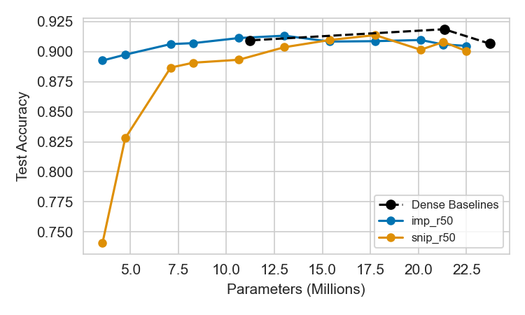

# Pruning Algorithms Research Project

This project investigates whether **pruning a large model (ResNet-50)** is fundamentally more effective than natively training smaller architectures (ResNet-34, ResNet-18). It evaluates the efficacy of two distinct pruning algorithms on the Oxford Flowers-102 classification dataset: Iterative Magnitude Pruning (IMP) [1] and Single-Shot Network Pruning (SNIP) [2].

## Main Results & Insights



*(Figure 1: Test Accuracy vs. Parameter Count. The black dashed line represents the Dense Baselines (ResNet-18, 34, 50) and includes EfficientNet-B0 as a lightweight baseline. The solid lines show the performance trajectories of IMP and SNIP applied to ResNet-50 across 11 sparsity levels.)*

### Critical Analysis of the Results
1. **Pruning Results**: The plot clearly shows that an Iteratively Pruned ResNet-50 (IMP) can be compressed down to ~3.5M parameters while still maintaining ~89% accuracy. In contrast, the natively trained ResNet-18 (~11M parameters) achieves roughly ~90% accuracy, and the lightweight EfficientNet-B0 (~4.1M parameters) achieves ~92% accuracy. By tracking the parameter counts on the X-axis, we see that the pruned network consistently matches or outperforms the naively downscaled dense models at equivalent sizes.
2. **Why do Pruned Models Perform So Well?**: The Oxford Flowers-102 dataset is very small (only 1,020 training images). A dense ResNet-50 (25M parameters) is massively overparameterized for this task, which naturally leads to extreme mathematical redundancy and a tendency to overfit (which explains why the mid-sized ResNet-34 actually outperformed it). However, because ResNet-50 starts with massive capacity and highly expressive pretrained features, pruning successfully strips away this redundancy while keeping the crucial feature-extracting weights intact.
3. **IMP vs. SNIP**: While SNIP is highly efficient (requiring only a single training run per target), it collapses at extreme sparsities (dropping to ~74% accuracy at 3.5M parameters). IMP remains incredibly robust, proving that the iterative retraining is strictly necessary for finding highly compressed sub-networks.
4. **Custom Architectures**: Also attempted to manually truncate ResNet18 into a custom architecture ([2, 2, 2, 1] blocks). The results were poor: ~45% accuracy, and they are excluded from the main plot to preserve scale, but the data can still be seen in `prev plots/` and `output/` logs.

### A Note on Unstructured Pruning
This project utilizes **Unstructured Pruning**. This means individual weights are masked to exactly `0.0` rather than structurally removing entire convolutional channels.

## Pruning Methods Detailed

1. **Iterative Magnitude Pruning (IMP)**
   IMP is a progressive, step-by-step pruning strategy. The pipeline works by:
   - Training a dense network to convergence.
   - Pruning a percentage of the weights with the lowest absolute magnitude.
   - Retraining the network for a short duration.
   - This process (Pruning & Retraining) is repeated iteratively to reach the desired level of sparsity.

2. **Single-Shot Network Pruning (SNIP)**
   SNIP is a "pruning at initialization" method:
   - Before training begins, it passes a small batch of data through the dense, initialized network to compute gradients.
   - It calculates the "Connection Sensitivity" of each weight by multiplying its magnitude by its gradient ($|w \times \nabla w|$).
   - Weights with the lowest sensitivity are masked permanently.
   - The remaining sparse network is then trained from scratch.

## Setup

The project uses `uv` (recommended) or Conda to manage its environment dependencies.

1. **Clone the repository:**
   ```bash
   git clone https://github.com/frustal/pruning-algorithms-research-project.git
   cd pruning-algorithms-research-project
   ```

2. **Install dependencies:**
   
   **Using `uv` (Fastest):**
   ```bash
   uv venv
   # On Windows:
   .\.venv\Scripts\activate
   # On Unix:
   source .venv/bin/activate
   
   uv pip install -r requirements.txt
   # or
   uv sync
   ```
   
   *Alternatively, using Conda:*
   ```bash
   conda env create -f environment.yaml
   conda activate pruning_env
   ```

3. **Dataset:** The Flowers-102 dataset will be automatically downloaded to a `data/` directory the first time you run an experiment.

## Usage

Experiments are managed through YAML configuration files located in the `configs/` directory.

### 1. Train Dense Baselines
Establish the "Dense Baselines" curve by training the standard ResNet architectures and EfficientNet-B0.
```bash
python train.py --config configs/default_r18.yaml
python train.py --config configs/default_r34.yaml
python train.py --config configs/default_r50.yaml
python train.py --config configs/default_effnet_b0.yaml
python train.py --config configs/default_r18_custom.yaml
```

### 2. Run Pruning Algorithms
Run IMP and SNIP on the ResNet-50 model. The configurations are set to sweep across 11 sparsity targets (from 5% down to 85% remaining weights) to accurately plot the degradation curve.

```bash
python train.py --config configs/imp_r50.yaml
python train.py --config configs/snip_r50.yaml
```

### 3. Plotting Results
Generate a comparative plot of test accuracy versus parameter count.
```bash
python plot_results.py --experiments default_r18 default_r34 default_r50 default_effnet_b0 imp_r50 snip_r50
```
This saves `final_results.png` to the project root.

### Cleaning Outputs
To clear all generated logs and models and start fresh:
```bash
python clear_outputs.py
```

## Project Structure
```text
.
├── configs/                # YAML configs (baselines & pruning)
├── output/                 # Generated models (.pth) and logs (.csv)
├── src/                    
│   ├── data.py             # Dataloaders for Flowers-102
│   ├── model.py            # ResNet factory functions
│   ├── utils.py            # CSV Logger and helpers
│   └── methods/            
│       ├── default.py      # Standard dense training
│       ├── imp.py          # IMP logic
│       └── snip.py         # SNIP logic
├── train.py                # Main experiment execution script
├── plot_results.py         # Matplotlib generation
├── requirements.txt        # Python dependencies
└── clear_outputs.py        # Utility to wipe logs/models
```

## References

[1] Song Han, Jeff Pool, John Tran, and William J. Dally. Learning both Weights and Connections for Efficient
Neural Networks. In Advances in Neural Information Processing Systems (NeurIPS), 2015, pp. 1135–1143.

[2] Namhoon Lee, Thalaiyasingam Ajanthan, and Philip H. S. Torr. SNIP: Single-shot Network Pruning based
on Connection Sensitivity. In Proceedings of the 7th International Conference on Learning Representations
(ICLR), 2019, pp. 1-15.

## License
This project is licensed under the MIT License. See the [LICENSE](LICENSE) file for details.
